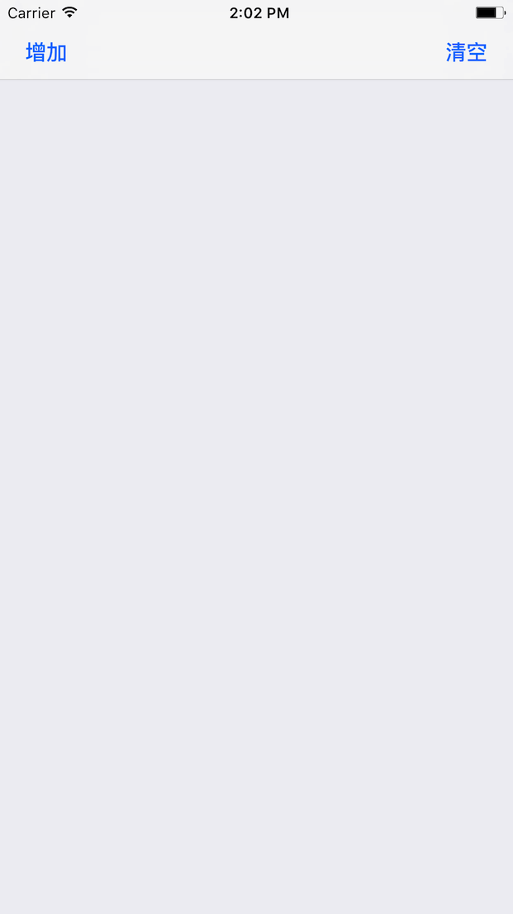

# DLEmptyDataSet 
## 介绍
DLEmptyDataSet 是一款在能在 UITableView 或者 UICollectionView  数据为空的时候显示一张占位图的小工具。

使用前：

使用后：

## 背景
有一个第三方库[DZNEmptyDataSet](https://github.com/dzenbot/DZNEmptyDataSet)做的很棒,但是由于使用 AutoLayout 的布局，使用 2 个 UITableView 的时候会出现不对齐的 Bug，并且没有好的方案来解决，于是重新写了一个这个东西，目前在项目中使用良好。

